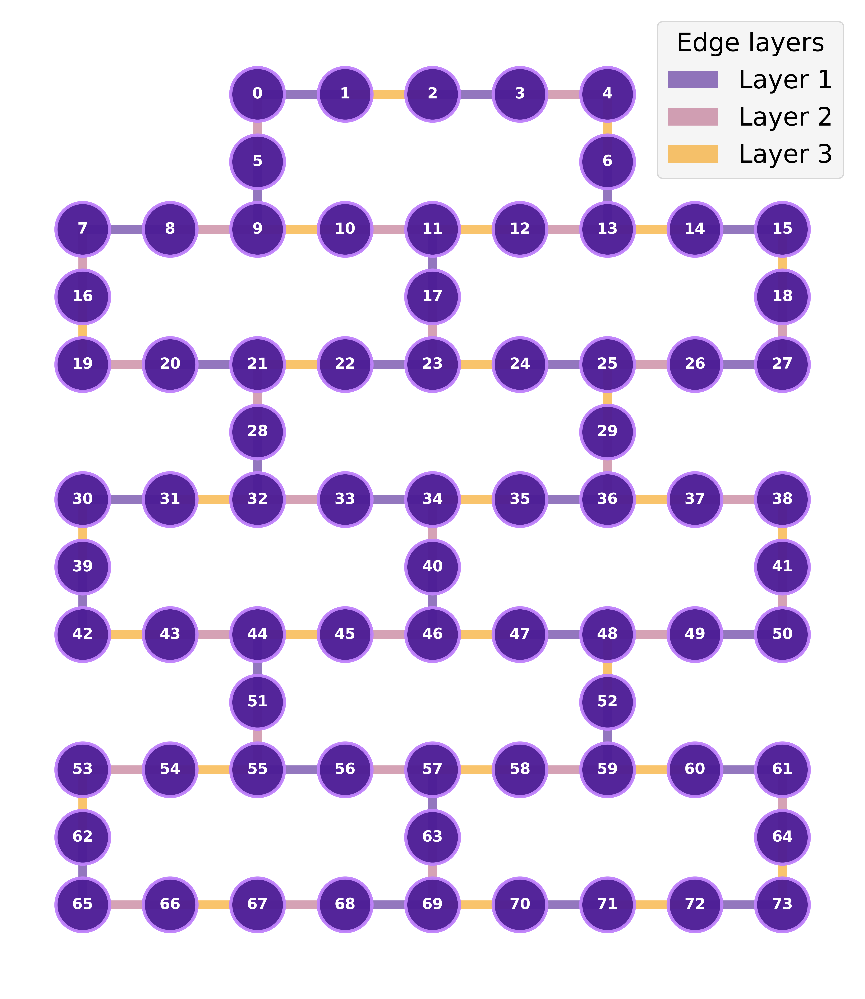
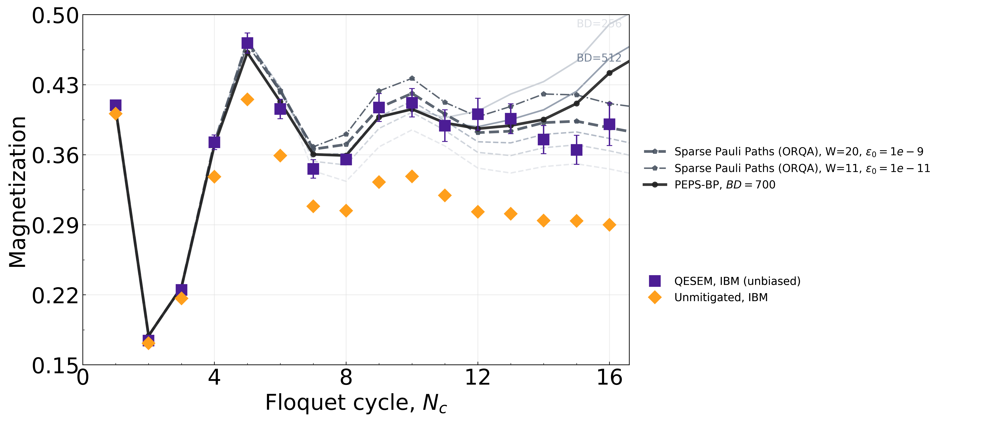
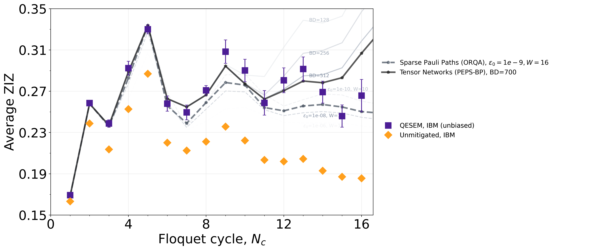
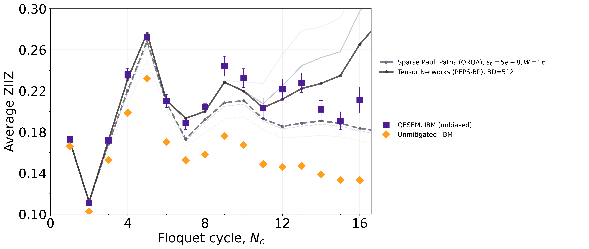

# Floquet Mixed-Field Ising Dynamics

[//]: # ()
[//]: # (`floquet_mixed_field_ising_mag_51qx16c`:)

[//]: # ()
[//]: # (This instance implements Floquet dynamics corresponding to the mixed-field Ising model on a heavy-hex lattice with $N=51$ qubits and $N_c=16$ Floquet cycles &#40;see details below&#41;. The measured observable is)

[//]: # (the magnetization, defined as)

[//]: # (```math)

[//]: # (M = \frac{1}{N}\sum_{i} Z_i,)

[//]: # (```)

[//]: # ()
[//]: # (where the sum runs over all the qubits of the heavy-hex lattice.)

[//]: # ()
[//]: # (`floquet_mixed_field_ising_zzd2_51qx16c`:)

[//]: # ()
[//]: # (This instance implements Floquet dynamics corresponding to the mixed-field Ising model on a heavy-hex lattice with $N=51$ qubits and $N_c=16$ Floquet cycles &#40;see details below&#41;. The measured observable is)

[//]: # (the average two-point correlator at graph distance $d=2$, defined as)

[//]: # (```math)

[//]: # (ZZ_{d=2} = \frac{1}{N_{d=2}} \; \sum_{&#40;i,j&#41;\,:\,d&#40;i,j&#41;=2} Z_i Z_j)

[//]: # (```)

[//]: # ()
[//]: # (where $&#40;i, j&#41;$ ranges over all pairs of qubits at graph distance $d=2$ within the heavy-hex lattice &#40;see pair list below&#41;, and $N_{d=2}$ is the total number of those pairs.)

[//]: # ()
[//]: # (`floquet_mixed_field_ising_zzd3_51qx16c`:)

[//]: # ()
[//]: # (This instance implements Floquet dynamics corresponding to the mixed-field Ising model on a heavy-hex lattice with $N=51$ qubits and $N_c=16$ Floquet cycles &#40;see details below&#41;. The measured observable is)

[//]: # (the average two-point correlator at graph distance $d=3$, defined as)

[//]: # (```math)

[//]: # (ZZ_{d=3} = \frac{1}{N_{d=3}} \; \sum_{&#40;i,j&#41;\,:\,d&#40;i,j&#41;=3} Z_i Z_j)

[//]: # (```)

[//]: # ()
[//]: # (where $&#40;i, j&#41;$ ranges over all pairs of qubits at graph distance $d=3$ within the heavy-hex lattice &#40;see pair list below&#41;, and $N_{d=3}$ is the total number of those pairs.)

[//]: # ()
[//]: # (- Each instance here is defined by the number of qubits, $N$, the number of Floquet cycles, $N_c$, as well as the observable measured at the end of the circuit. Thus, the name of the instance follows the pattern `floquet_mixed_field_ising_{measured observable}_{N}qx{N_c}c`.)

## Circuit Instances

Each instance implements Floquet dynamics corresponding to the mixed-field Ising model on a heavy-hex lattice with $N=51$ or $N=74$ qubits, evolved over $N_c$ Floquet cycles (see [Model Description](#model-description) below). Three observables are measured, corresponding to different instance variants:

- **Magnetization (`mag`):** 
```math
M = \frac{1}{N}\sum_{i} Z_i,
```
  where the sum runs over all the qubits of the heavy-hex lattice.

- **Average two-point correlator at graph distance $d=2$ (`zzd2`):**
```math
ZZ_{d=2} = \frac{1}{N_{d=2}} \; \sum_{(i,j)\,:\,d(i,j)=2} Z_i Z_j
```
  where $(i, j)$ ranges over all pairs of qubits at graph distance $d=2$ within the heavy-hex lattice (see pair list below), and $N_{d=2}$ is the total number of those pairs.

- **Average two-point correlator at graph distance $d=3$ (`zzd3`):**
```math
ZZ_{d=3} = \frac{1}{N_{d=3}} \; \sum_{(i,j)\,:\,d(i,j)=3} Z_i Z_j
```
  where $(i, j)$ ranges over all pairs of qubits at graph distance $d=3$ within the heavy-hex lattice (see pair list below), and $N_{d=3}$ is the total number of those pairs.

Each instance is defined by the number of qubits, $N$, the number of Floquet cycles, $N_c$, and the observable measured at the end of the circuit. The instance name follows the pattern `floquet_mixed_field_ising_{observable}_{N}qx{N_c}c`.

| Instance name                            | $N$ | $N_c$ | Observable |
|------------------------------------------|-----|-------|---|
| `floquet_mixed_field_ising_mag_51qx16c`  | 51  | 16    | Magnetization |
| `floquet_mixed_field_ising_zzd2_51qx16c` | 51  | 16    | $ZZ_{d=2}$ |
| `floquet_mixed_field_ising_zzd3_51qx16c` | 51  | 16    | $ZZ_{d=3}$ |
| `floquet_mixed_field_ising_mag_51qx30c`  | 51  | 30    | Magnetization |
| `floquet_mixed_field_ising_mag_74qx27c`  | 74  | 27    | Magnetization |


## Model Description

The experiment explores non-equilibrium Floquet dynamics of the 2D mixed-field Ising model on a heavy-hex lattice of $N$ qubits.
In those circuits, the qubits are initialized in
$$|\psi_0\rangle = |0\rangle^{\otimes N}$$
and evolved over $N_c$ Floquet cycles to

$$|\psi(N_c)\rangle = U_F^{N_c} |\psi_0\rangle.$$

Each Floquet cycle $U_F = U_3 \cdot U_2 \cdot U_1$ consists of three layers, where:

```math
U_m = \prod_{(j,k)\in\mathcal{E}_m} RZZ(\theta_{zz})
      \prod_{i} RZ\left(\tfrac{\theta_z}{3}\right)
      \prod_{i} RX\left(\tfrac{\theta_x}{3}\right)
```

Here $\mathcal{E}_1, \mathcal{E}_2, \mathcal{E}_3$ form a partition of all edges
of the $N$-qubit patch into three disjoint subsets.

## Additional Details

**Additional details for the circuit instances corresponding to the $N=51$-qubit lattice**:

- Lattice

  The 51-qubit patch follows the IBM heavy-hex connectivity, with qubits indexed 0-50. The lattice is shown below; different edge colors correspond to the three edge layers $\mathcal{E}_1, \mathcal{E}_2, \mathcal{E}_3$ (see the table below).

 

- Edge Layers

  | Layer           | Edges                                                                                                                                                                   |
  | --------------- | ----------------------------------------------------------------------------------------------------------------------------------------------------------------------- |
  | $\mathcal{E}_1$ | [(0, 1),(3, 4),(5, 9),(10, 11),(6, 13),(16, 19),(20, 21),(17, 23),(24, 25),(18, 27),(28, 32),(33, 34),(29, 36),(37, 38),(39, 42),(43, 44),(40, 46),(47, 48),(41, 50)]   |
  | $\mathcal{E}_2$ | [(2, 3),(7, 8),(9, 10),(11, 12),(13, 14),(15, 18),(19, 20),(21, 22),(23, 24),(25, 26),(30, 31),(32, 33),(34, 35),(36, 37),(38, 41),(42, 43),(44, 45),(46, 47),(48, 49)] |
  | $\mathcal{E}_3$ | [(1, 2),(0, 5),(4, 6),(8, 9),(12, 13),(7, 16),(11, 17),(22, 23),(26, 27),(21, 28),(25, 29),(31, 32),(35, 36),(30, 39),(34, 40),(45, 46),(49, 50),(14, 15)]              |

- Circuit parameters

  | Parameter     | Value     |
  | ------------- | --------- |
  | $\theta_x$    | $1.56567$ |
  | $\theta_z$    | $0.33879$ |
  | $\theta_{zz}$ | $\pi/3$   |

- Pair lists for $ZZ_{d=2}$ and $ZZ_{d=3}$ observables

  | Observable | Pair list                                                                                                                                                                                                                                                                                                                                                                                                                                                                                                                                                                                                                                                                                                                                                                                                                                                        |
  | ---------- | ---------------------------------------------------------------------------------------------------------------------------------------------------------------------------------------------------------------------------------------------------------------------------------------------------------------------------------------------------------------------------------------------------------------------------------------------------------------------------------------------------------------------------------------------------------------------------------------------------------------------------------------------------------------------------------------------------------------------------------------------------------------------------------------------------------------------------------------------------------------- |
  | $ZZ_{d=2}$ | [[6, 12], [16, 20], [32, 34], [41, 49], [18, 26], [15, 27], [29, 35], [5, 10], [46, 48], [0, 2], [23, 25], [38, 50], [40, 47], [9, 11], [17, 24], [10, 12], [1, 3], [19, 21], [11, 23], [28, 33], [34, 46], [47, 49], [24, 26], [6, 14], [33, 35], [30, 42], [7, 19], [24, 29], [42, 44], [26, 29], [43, 45], [3, 6], [20, 22], [20, 28], [14, 18], [29, 37], [22, 28], [2, 4], [48, 50], [34, 36], [1, 5], [11, 13], [10, 17], [30, 32], [37, 41], [7, 9], [25, 27], [33, 40], [35, 37], [25, 36], [21, 23], [35, 40], [12, 14], [44, 46], [12, 17], [4, 13], [5, 8], [22, 24], [31, 33], [21, 32], [31, 39], [0, 9], [8, 10], [8, 16], [39, 43], [17, 22], [40, 45], [28, 31], [36, 38], [45, 47], [13, 15]]                                                                                                                                                   |
  | $ZZ_{d=3}$ | [[33, 36], [43, 46], [3, 13], [17, 21], [34, 37], [9, 17], [11, 14], [28, 30], [13, 17], [6, 11], [7, 10], [32, 39], [44, 47], [29, 34], [8, 11], [39, 44], [9, 12], [23, 29], [31, 42], [27, 29], [36, 41], [47, 50], [42, 45], [30, 43], [5, 7], [29, 38], [22, 32], [12, 15], [22, 25], [9, 16], [45, 48], [16, 21], [5, 11], [46, 49], [35, 46], [23, 26], [2, 6], [19, 22], [17, 25], [13, 18], [28, 34], [25, 35], [6, 15], [20, 23], [26, 36], [20, 32], [21, 31], [23, 28], [40, 44], [1, 9], [36, 40], [30, 33], [41, 48], [18, 25], [21, 24], [21, 33], [38, 49], [34, 45], [10, 23], [11, 22], [37, 50], [33, 46], [12, 23], [1, 4], [8, 19], [19, 28], [34, 47], [11, 24], [24, 27], [32, 40], [7, 20], [24, 36], [4, 12], [0, 8], [2, 5], [15, 26], [35, 38], [25, 37], [4, 14], [31, 34], [0, 10], [14, 27], [32, 35], [0, 3], [10, 13], [40, 48]] |


**Additional details for the circuit instances corresponding to the $N=74$-qubit lattice**:

- Lattice

  The 74-qubit patch follows the IBM heavy-hex connectivity, with qubits indexed 0-73. The lattice is shown below; different edge colors correspond to the three edge layers $\mathcal{E}_1, \mathcal{E}_2, \mathcal{E}_3$ (see the table below).

 

- Edge Layers

  | Layer           | Edges                                                                                                                                                                   |
  | --------------- | ----------------------------------------------------------------------------------------------------------------------------------------------------------------------- |
  | $\mathcal{E}_1$ | [(0, 1), (2, 3), (5, 9), (6, 13), (7, 8), (11, 17), (14, 15), (20, 21), (22, 23), (24, 25), (26, 27), (28, 32), (30, 31), (33, 34), (35, 36), (39, 42), (40, 46), (44, 51), (47, 48), (49, 50), (52, 59), (55, 56), (57, 63), (60, 61), (62, 65), (68, 69), (70, 71), (72, 73)]  |
  | $\mathcal{E}_2$ | [(0, 5), (3, 4), (7, 16), (8, 9), (10, 11), (12, 13), (17, 23), (18, 27), (19, 20), (21, 28), (25, 26), (29, 36), (32, 33), (34, 40), (37, 38), (41, 50), (43, 44), (45, 46), (48, 49), (51, 55), (53, 54), (56, 57), (58, 59), (61, 64), (63, 69), (65, 66), (67, 68)] |
  | $\mathcal{E}_3$ |  [(1, 2), (4, 6), (9, 10), (11, 12), (13, 14), (15, 18), (16, 19), (21, 22), (23, 24), (25, 29), (30, 39), (31, 32), (34, 35), (36, 37), (38, 41), (42, 43), (44, 45), (46, 47), (48, 52), (53, 62), (54, 55), (57, 58), (59, 60), (64, 73), (66, 67), (69, 70), (71, 72)] |

- Circuit parameters

  | Parameter     | Value     |
  | ------------- | --------- |
  | $\theta_x$    | $1.56567$ |
  | $\theta_z$    | $0.33879$ |
  | $\theta_{zz}$ | $\pi/3$   |

- Pair lists for $ZZ_{d=2}$ and $ZZ_{d=3}$ observables

  | Observable | Pair list                                                                                                                                                                                                                                                                                                                                                                                                                                                                                                                                                                                                                                                                                                                                                                                                                                                        |
  | ---------- | ---------------------------------------------------------------------------------------------------------------------------------------------------------------------------------------------------------------------------------------------------------------------------------------------------------------------------------------------------------------------------------------------------------------------------------------------------------------------------------------------------------------------------------------------------------------------------------------------------------------------------------------------------------------------------------------------------------------------------------------------------------------------------------------------------------------------------------------------------------------- |
  | $ZZ_{d=2}$ | [(63, 70), (52, 60), (68, 70), (5, 8), (29, 35), (20, 28), (11, 13), (46, 48), (63, 68), (38, 50), (15, 27), (55, 57), (47, 49), (35, 40), (54, 56), (43, 51), (11, 23), (32, 34), (64, 72), (53, 55), (22, 28), (40, 45), (35, 37), (56, 63), (61, 73), (52, 58), (13, 15), (34, 36), (33, 35), (12, 14), (30, 32), (26, 29), (28, 33), (40, 47), (5, 10), (4, 13), (60, 64), (21, 23), (42, 44), (62, 66), (34, 46), (8, 16), (39, 43), (56, 58), (51, 56), (28, 31), (25, 36), (44, 46), (7, 9), (10, 17), (1, 3), (57, 69), (1, 5), (71, 73), (10, 12), (20, 22), (12, 17), (48, 50), (19, 21), (58, 63), (44, 55), (65, 67), (47, 52), (0, 9), (36, 38), (67, 69), (59, 61), (57, 59), (45, 47), (66, 68), (3, 6), (54, 62), (41, 49), (70, 72), (30, 42), (69, 71), (9, 11), (7, 19), (45, 51), (24, 29), (14, 18), (25, 27), (22, 24), (31, 33), (33, 40), (16, 20), (58, 60), (23, 25), (21, 32), (17, 22), (8, 10), (0, 2), (18, 26), (53, 65), (17, 24), (6, 12), (6, 14), (43, 45), (31, 39), (37, 41), (48, 59), (29, 37), (24, 26), (49, 52), (2, 4), (51, 54)] |
  | $ZZ_{d=3}$ | [(0, 3), (0, 8), (0, 10), (1, 9), (1, 4), (2, 5), (2, 6), (3, 13), (5, 7), (5, 11), (9, 16), (9, 17), (9, 12), (6, 11), (6, 15), (13, 17), (10, 13), (13, 18), (7, 10), (7, 20), (8, 11), (8, 19), (11, 24), (11, 22), (11, 14), (17, 25), (17, 21), (4, 14), (14, 27), (15, 26), (12, 15), (20, 32), (20, 23), (16, 21), (21, 33), (21, 31), (21, 24), (19, 22), (22, 32), (22, 25), (23, 26), (23, 29), (10, 23), (12, 23), (23, 28), (24, 27), (24, 36), (18, 25), (25, 37), (25, 35), (26, 36), (27, 29), (28, 34), (28, 30), (19, 28), (32, 40), (32, 35), (32, 39), (30, 43), (30, 33), (31, 34), (31, 42), (33, 46), (33, 36), (34, 45), (34, 47), (34, 37), (29, 34), (35, 46), (35, 38), (36, 41), (36, 40), (39, 44), (42, 51), (42, 45), (40, 44), (40, 48), (43, 46), (46, 51), (46, 49), (46, 52), (44, 56), (44, 54), (44, 47), (51, 57), (51, 53), (47, 50), (47, 59), (41, 48), (48, 58), (48, 60), (45, 48), (49, 59), (38, 49), (50, 52), (37, 50), (52, 57), (52, 61), (56, 59), (59, 63), (59, 64), (55, 58), (55, 63), (43, 55), (45, 55), (55, 62), (56, 69), (53, 56), (54, 57), (57, 60), (57, 68), (57, 70), (63, 67), (63, 71), (60, 73), (61, 72), (58, 61), (62, 67), (65, 68), (54, 65), (68, 71), (66, 69), (69, 72), (58, 69), (67, 70), (70, 73), (64, 71), (4, 12), (29, 38), (53, 66)] |

## Results

The figures below show the estimated three observables across $N_c\in [1,16]$ Floquet cycles for $N=51$ qubits (same layers and configuration as described above), comparing results from three methods carried out by the institutions involved in this submission:

- **QESEM, IBM (unbiased):** Results obtained on ibm_boston using Qedma's error-suppression and error-mitigation software (QESEM) <sup>[[1]](#ref1)</sup>. QESEM (unbiased) combines high-accuracy characterization, quasi-probabilistic mitigation of fractional-angle entangling gates, and active volume identification. This approach yields expectation values that are unbiased up to characterization error; the error bars reflect the statistical uncertainties of the mitigation <sup>[[1]](#ref1)</sup>.
- **QESEM, IBM (ZNE):** Results obtained on ibm_boston using Qedma's error-suppression and error-mitigation software (QESEM) using a protocol that uses the same device characterization, Pauli-noise modeling, error-suppression stack, drift handling, and hardware-native fractional-angle gate support as QESEM-unbiased, building on the framework described in Ref. <sup>[[1]](#ref1)</sup>. As in the “QESEM, IBM (unbiased)", the Floquet circuit is implemented directly using the device’s native fractional-angle gates, including fractional-angle RZZ gates.
For the later Floquet cycles reported here, the sampling overhead of the unbiased quasiprobabilistic estimator is too large. We therefore use zero-noise extrapolation (ZNE) based on QESEM, following the standard approach of estimating observables at amplified noise levels and extrapolating to zero noise <sup>[[3]](#ref3)</sup>. In this implementation, double-noise data are generated using quasiprobabilistic error amplification from the characterized noise model, and the zero-noise value is inferred using an exponential extrapolation ansatz.
- **Sparse Pauli Paths (ORQA):** A Sparse Pauli Path (SPP) method based on a scalable parallel implementation of the ORQA formalism <sup>[[2]](#ref2)</sup>, executed on the supercomputer Fugaku. Here $\varepsilon_0$ is the truncation threshold and $W$ is the maximum Pauli weight considered in the tracked Pauli paths.

- **Tensor Networks with Belief Propagation (PEPS-BP):** Based on evolving the wavefunction as a projected entangled pair state (PEPS) with belief propagation, implemented with the open-source package [TensorNetworkQuantumSimulator.jl](https://JoeyT1994.github.io/TensorNetworkQuantumSimulator.jl/).

From the results shown below, neither classical method achieves convincing convergence despite the substantial computational resources employed.
PEPS-BP remains reliable only up to $N_c\sim 12$, beyond which convergence is lost both relative to the quantum data and across the different bond dimensions.
Likewise, SPP simulations do not agree with each other or with the quantum data beyond $7$ Floquet cycles. For example, for the magnetization observable, the $(W,\varepsilon_0)=(11,10^{-11})$ and $(20,10^{-9})$ runs consume comparably extensive resources, tracking a peak of $\sim 1.4\times10^{12}$ and $\sim 7\times10^{11}$ Pauli paths,
respectively, yet still diverge from one another. The $(W,\varepsilon_0)=(11,10^{-11})$ curve tends to overestimate the quantum data, most visibly near cycle $15$, and both curves are phase-shifted relative to the quantum data, showing a peak where the quantum results show a dip instead, altogether indicating that any apparent agreement with the quantum data is incidental rather than systematic. The classical methods face a similar, and even more severe, difficulty at the late time steps, as shown in the table below (26, 29 and 30 cycles).

**Note:** The faded dashed lines correspond to SPP (ORQA) results obtained with larger truncation thresholds ($\epsilon_0$) and smaller maximum Pauli weights ($W$), while the faded solid lines correspond to PEPS-BP results with smaller bond dimensions (BD).

**Magnetization (M):**



**Average ZIZ ($ZZ_{d=2}$):**




**Average ZIIZ ($ZZ_{d=3}$):**




The tables below summarize the above three observables' expectation values at the last four points of the dynamics shown above, obtained from each method, along with the runtimes and compute resources.

**Magnetization**:

<table>
  <thead>
    <tr><th>Cycle</th><th>Method</th><th>Expectation Value<br>(lower, upper)</th><th>Runtime</th><th>Hardware</th></tr>
  </thead>
  <tbody>
    <tr style="border-top: 2px solid #d1d5db;"><td>13</td><td>QESEM, IBM<br>(Unbiased)</td><td>0.396 (0.381, 0.411)</td><td>3,184s (Q) + 1,774s (C)</td><td>ibm_boston</td></tr>
    <tr><td>13</td><td>PEPS-BP<br>(BD=700)</td><td>0.3891136</td><td>52,793s (C)</td><td>128 vCPUs (AMD EPYC 7R13), 334 GiB RAM (allocated)</td></tr>
    <tr><td>13</td><td>SPP<br>(W=11, ε₀=1e-11)</td><td>0.40829123</td><td>43,698s (C)</td><td>12,288 Fugaku nodes (65,536 cores)</td></tr>
    <tr><td>13</td><td>SPP<br>(W=20, ε₀=1e-9)</td><td>0.38356027</td><td>22,228s (C)</td><td>12,288 Fugaku nodes (65,536 cores)</td></tr>
    <tr style="border-top: 2px solid #d1d5db;"><td>14</td><td>QESEM, IBM<br>(Unbiased)</td><td>0.3751 (0.3611, 0.3891)</td><td>4,857s (Q) + 2,706s (C)</td><td>ibm_boston</td></tr>
    <tr><td>14</td><td>PEPS-BP<br>(BD=700)</td><td>0.395225</td><td>181,760s (C)</td><td>128 vCPUs (AMD EPYC 7R13), 334 GiB RAM (allocated)</td></tr>
    <tr><td>14</td><td>SPP<br>(W=11, ε₀=1e-11)</td><td>0.42070765</td><td>47,041s (C)</td><td>12,288 Fugaku nodes (65,536 cores)</td></tr>
    <tr><td>14</td><td>SPP<br>(W=20, ε₀=1e-9)</td><td>0.39211172</td><td>23,061s (C)</td><td>12,288 Fugaku nodes (65,536 cores)</td></tr>
    <tr style="border-top: 2px solid #d1d5db;"><td>15</td><td>QESEM, IBM<br>(Unbiased)</td><td>0.3649 (0.3503, 0.3795)</td><td>8,615s (Q) + 4,801s (C)</td><td>ibm_boston</td></tr>
    <tr><td>15</td><td>PEPS-BP<br>(BD=700)</td><td>0.4112448</td><td>317,861s (C)</td><td>128 vCPUs (AMD EPYC 7R13), 334 GiB RAM (allocated)</td></tr>
    <tr><td>15</td><td>SPP<br>(W=11, ε₀=1e-11)</td><td>0.41982974</td><td>50,008s (C)</td><td>12,288 Fugaku nodes (65,536 cores)</td></tr>
    <tr><td>15</td><td>SPP<br>(W=20, ε₀=1e-9)</td><td>0.39349978</td><td>23,734s (C)</td><td>12,288 Fugaku nodes (65,536 cores)</td></tr>
    <tr style="border-top: 2px solid #d1d5db;"><td>16</td><td>QESEM, IBM<br>(Unbiased)</td><td>0.3904 (0.3691, 0.4117)</td><td>6,228s (Q) + 3,471s (C)</td><td>ibm_boston</td></tr>
    <tr><td>16</td><td>PEPS-BP<br>(BD=700)</td><td>0.4417984</td><td>392,770s (C)</td><td>128 vCPUs (AMD EPYC 7R13), 334 GiB RAM (allocated)</td></tr>
    <tr><td>16</td><td>SPP<br>(W=11, ε₀=1e-11)</td><td>0.41110594</td><td>52,679s (C)</td><td>12,288 Fugaku nodes (65,536 cores)</td></tr>
    <tr><td>16</td><td>SPP<br>(W=20, ε₀=1e-9)</td><td>0.38697176</td><td>24,307s (C)</td><td>12,288 Fugaku nodes (65,536 cores)</td></tr>

<tr style="border-top: 2px solid #d1d5db;"><td>26</td><td>QESEM, IBM<br>(ZNE)</td><td>0.3771 (0.3722, 0.3820)</td><td>1200s (Q) + 668s (C)</td><td>ibm_boston</td></tr>
    <tr><td>26</td><td>PEPS-BP<br>(BD=700)</td><td>0.5426771</td><td>1,629,291s (C)</td><td>128 vCPUs (AMD EPYC 7R13), 334 GiB RAM (allocated)</td></tr>
    <tr><td>26</td><td>SPP<br>(W=11, ε₀=1e-11)</td><td>0.39336</td><td>72,410s (C)</td><td>12,288 Fugaku nodes (65,536 cores)</td></tr>
    <tr><td>26</td><td>SPP<br>(W=20, ε₀=1e-9)</td><td>0.35934</td><td>28,403s (C)</td><td>12,288 Fugaku nodes (65,536 cores)</td></tr>
    <tr style="border-top: 2px solid #d1d5db;"><td>29</td><td>QESEM, IBM<br>(ZNE)</td><td>0.3569 (0.3528, 0.3610)</td><td>2440s (Q) + 1,360s (C)</td><td>ibm_boston</td></tr>
    <tr><td>29</td><td>PEPS-BP<br>(BD=512)</td><td>0.531491</td><td>122,727s (C)</td><td>96 vCPUs (AMD EPYC 7571)</td></tr>
    <tr><td>29</td><td>SPP<br>(W=11, ε₀=1e-11)</td><td>0.387118</td><td>77,204s (C)</td><td>12,288 Fugaku nodes (65,536 cores)</td></tr>
    <tr><td>29</td><td>SPP<br>(W=20, ε₀=1e-9)</td><td>0.351997</td><td>29,464s (C)</td><td>12,288 Fugaku nodes (65,536 cores)</td></tr>
    <tr style="border-top: 2px solid #d1d5db;"><td>30</td><td>QESEM, IBM<br>(ZNE)</td><td>0.3662 (0.3596, 0.3727)</td><td>1470 (Q) + 819s (C)</td><td>ibm_boston</td></tr>
    <tr><td>30</td><td>PEPS-BP<br>(BD=512)</td><td>0.548851</td><td>127,669s (C)</td><td>96 vCPUs (AMD EPYC 7571)</td></tr>
    <tr><td>30</td><td>SPP<br>(W=11, ε₀=1e-11)</td><td>0.385073</td><td>78,738.4s (C)</td><td>12,288 Fugaku nodes (65,536 cores)</td></tr>
    <tr><td>30</td><td>SPP<br>(W=20, ε₀=1e-9)</td><td>0.349819</td><td>29,812.34s (C)</td><td>12,288 Fugaku nodes (65,536 cores)</td></tr>
</tbody>
</table>

**ZIZ**:

<table>
  <thead>
    <tr><th>Cycle</th><th>Method</th><th>Expectation Value<br>(lower, upper)</th><th>Runtime</th><th>Hardware</th></tr>
  </thead>
  <tbody>
    <tr style="border-top: 2px solid #d1d5db;"><td>13</td><td>QESEM, IBM<br>(Unbiased)</td><td>0.2916 (0.2800, 0.3032)</td><td>3,184s (Q) + 1,774s (C)</td><td>ibm_boston</td></tr>
    <tr><td>13</td><td>PEPS-BP<br>(BD=700)</td><td>0.2798922</td><td>55,186s (C)</td><td>128 vCPUs (AMD EPYC 7R13), 334 GiB RAM (allocated)</td></tr>
    <tr><td>13</td><td>SPP<br>(W=16, ε₀=1e-9)</td><td>0.255711</td><td>27,435s (C)</td><td>12,288 Fugaku nodes (65,536 cores)</td></tr>
    <tr style="border-top: 2px solid #d1d5db;"><td>14</td><td>QESEM, IBM<br>(Unbiased)</td><td>0.2692 (0.2585, 0.2798)</td><td>4,857s (Q) + 2,706s (C)</td><td>ibm_boston</td></tr>
    <tr><td>14</td><td>PEPS-BP<br>(BD=700)</td><td>0.27823183</td><td>184,210s (C)</td><td>128 vCPUs (AMD EPYC 7R13), 334 GiB RAM (allocated)</td></tr>
    <tr><td>14</td><td>SPP<br>(W=16, ε₀=1e-9)</td><td>0.257173</td><td>28,996s (C)</td><td>12,288 Fugaku nodes (65,536 cores)</td></tr>
    <tr style="border-top: 2px solid #d1d5db;"><td>15</td><td>QESEM, IBM<br>(Unbiased)</td><td>0.2459 (0.2351, 0.2567)</td><td>8,615s (Q) + 4,801s (C)</td><td>ibm_boston</td></tr>
    <tr><td>15</td><td>PEPS-BP<br>(BD=700)</td><td>0.28312767</td><td>320,324s (C)</td><td>128 vCPUs (AMD EPYC 7R13), 334 GiB RAM (allocated)</td></tr>
    <tr><td>15</td><td>SPP<br>(W=16, ε₀=1e-9)</td><td>0.254728</td><td>30,355s (C)</td><td>12,288 Fugaku nodes (65,536 cores)</td></tr>
    <tr style="border-top: 2px solid #d1d5db;"><td>16</td><td>QESEM, IBM<br>(Unbiased)</td><td>0.2657 (0.2501, 0.2814)</td><td>6,228s (Q) + 3,471s (C)</td><td>ibm_boston</td></tr>
    <tr><td>16</td><td>PEPS-BP<br>(BD=700)</td><td>0.30682474</td><td>395,319s (C)</td><td>128 vCPUs (AMD EPYC 7R13), 334 GiB RAM (allocated)</td></tr>
    <tr><td>16</td><td>SPP<br>(W=16, ε₀=1e-9)</td><td>0.250253</td><td>31,559s (C)</td><td>12,288 Fugaku nodes (65,536 cores)</td></tr>
    <tr style="border-top: 2px solid #d1d5db;"><td>26</td><td>QESEM, IBM<br>(ZNE)</td><td>0.2604 (0.2569, 0.2639)</td><td>1200s (Q) + 668s (C)</td><td>ibm_boston</td></tr>
    <tr><td>26</td><td>PEPS-BP<br>(BD=700)</td><td>0.3985</td><td>1,631,757s (C)</td><td>128 vCPUs (AMD EPYC 7R13), 334 GiB RAM (allocated)</td></tr>
    <tr><td>26</td><td>SPP<br>(W=16, ε₀=1e-9)</td><td>0.2355</td><td>40,351s (C)</td><td>12,288 Fugaku nodes (65,536 cores)</td></tr>
    <tr style="border-top: 2px solid #d1d5db;"><td>29</td><td>QESEM, IBM<br>(ZNE)</td><td>0.2454 (0.2424, 0.2484)</td><td>2440s (Q) + 1,360s (C)</td><td>ibm_boston</td></tr>
    <tr><td>29</td><td>PEPS-BP<br>(BD=512)</td><td>0.3965</td><td>122,903s (C)</td><td>96 vCPUs (AMD EPYC 7571)</td></tr>
    <tr><td>29</td><td>SPP<br>(W=16, ε₀=1e-9)</td><td>0.250253</td><td>42,506s (C)</td><td>12,288 Fugaku nodes (65,536 cores)</td></tr>
    <tr style="border-top: 2px solid #d1d5db;"><td>30</td><td>QESEM, IBM<br>(ZNE)</td><td>0.2523 (0.2476, 0.2571)</td><td>1470s (Q) + 819s (C)</td><td>ibm_boston</td></tr>
    <tr><td>30</td><td>PEPS-BP<br>(BD=512)</td><td>0.4098</td><td>127,853s (C)</td><td>96 vCPUs (AMD EPYC 7571)</td></tr>
    <tr><td>30</td><td>SPP<br>(W=16, ε₀=1e-9)</td><td>0.23</td><td>43,200s (C)</td><td>12,288 Fugaku nodes (65,536 cores)</td></tr>

</tbody>
</table>

**ZIIZ**:

<table>
  <thead>
    <tr><th>Cycle</th><th>Method</th><th>Expectation Value<br>(lower, upper)</th><th>Runtime</th><th>Hardware</th></tr>
  </thead>
  <tbody>
    <tr style="border-top: 2px solid #d1d5db;"><td>13</td><td>QESEM</td><td>0.2278 (0.2183, 0.2374)</td><td>3,184s (Q) + 1,774s (C)</td><td>ibm_boston</td></tr>
    <tr><td>13</td><td>PEPS-BP<br>(BD=700)</td><td>0.21647733</td><td>57,793s (C)</td><td>128 vCPUs (AMD EPYC 7R13), 334 GiB RAM (allocated)</td></tr>
    <tr><td>13</td><td>SPP<br>(W=16, ε₀=5e-8)</td><td>0.1885839</td><td>7,061s (C)</td><td>12,288 Fugaku nodes (65,536 cores)</td></tr>
    <tr style="border-top: 2px solid #d1d5db;"><td>14</td><td>QESEM</td><td>0.2020 (0.1935, 0.2106)</td><td>4,857s (Q) + 2,706s (C)</td><td>ibm_boston</td></tr>
    <tr><td>14</td><td>PEPS-BP<br>(BD=700)</td><td>0.21814969</td><td>187,052s (C)</td><td>128 vCPUs (AMD EPYC 7R13), 334 GiB RAM (allocated)</td></tr>
    <tr><td>14</td><td>SPP<br>(W=16, ε₀=5e-8)</td><td>0.19071564</td><td>7,405s (C)</td><td>12,288 Fugaku nodes (65,536 cores)</td></tr>
    <tr style="border-top: 2px solid #d1d5db;"><td>15</td><td>QESEM</td><td>0.1909 (0.1822, 0.1997)</td><td>8,615s (Q) + 4,801s (C)</td><td>ibm_boston</td></tr>
    <tr><td>15</td><td>PEPS-BP<br>(BD=700)</td><td>0.22427787</td><td>323,166s (C)</td><td>128 vCPUs (AMD EPYC 7R13), 334 GiB RAM (allocated)</td></tr>
    <tr><td>15</td><td>SPP<br>(W=16, ε₀=5e-8)</td><td>0.1884349</td><td>7,699s (C)</td><td>12,288 Fugaku nodes (65,536 cores)</td></tr>
    <tr style="border-top: 2px solid #d1d5db;"><td>16</td><td>QESEM</td><td>0.2111 (0.1984, 0.2238)</td><td>6,228s (Q) + 3,471s (C)</td><td>ibm_boston</td></tr>
    <tr><td>16</td><td>PEPS-BP<br>(BD=700)</td><td>0.2519062</td><td>398,093s (C)</td><td>128 vCPUs (AMD EPYC 7R13), 334 GiB RAM (allocated)</td></tr>
    <tr><td>16</td><td>SPP<br>(W=16, ε₀=5e-8)</td><td>0.18342936</td><td>7,961s (C)</td><td>12,288 Fugaku nodes (65,536 cores)</td></tr>
    <tr style="border-top: 2px solid #d1d5db;"><td>26</td><td>QESEM, IBM<br>(ZNE)</td><td>0.2041 (0.2009, 0.2074)</td><td>1200s (Q) + 668s (C)</td><td>ibm_boston</td></tr>
    <tr><td>26</td><td>PEPS-BP<br>(BD=700)</td><td>0.352624</td><td>1,634,575s (C)</td><td>128 vCPUs (AMD EPYC 7R13), 334 GiB RAM (allocated)</td></tr>
    <tr><td>26</td><td>SPP<br>(W=16, ε₀=5e-8)</td><td>0.1679</td><td>10,093s (C)</td><td>12,288 Fugaku nodes (65,536 cores)</td></tr>
    <tr style="border-top: 2px solid #d1d5db;"><td>29</td><td>QESEM, IBM<br>(ZNE)</td><td>0.1920 (0.1893, 0.1947)</td><td>2440s (Q) + 1,360s (C)</td><td>ibm_boston</td></tr>
    <tr><td>29</td><td>PEPS-BP<br>(BD=512)</td><td>0.3496</td><td>123,956.19s (C)</td><td>96 vCPUs (AMD EPYC 7571)</td></tr>
    <tr><td>29</td><td>SPP<br>(W=16, ε₀=5e-8)</td><td>0.1643</td><td>10,629s (C)</td><td>12,288 Fugaku nodes (65,536 cores)</td></tr>
    <tr style="border-top: 2px solid #d1d5db;"><td>30</td><td>QESEM, IBM<br>(ZNE)</td><td>0.1993 (0.1948, 0.2039)</td><td>1470s (Q) + 819s (C)</td><td>ibm_boston</td></tr>
    <tr><td>30</td><td>PEPS-BP<br>(BD=512)</td><td>0.3658</td><td>128,947s (C)</td><td>96 vCPUs (AMD EPYC 7571)</td></tr>
    <tr><td>30</td><td>SPP<br>(W=16, ε₀=5e-8)</td><td>0.163156</td><td>10,800s (C)</td><td>12,288 Fugaku nodes (65,536 cores)</td></tr>
  </tbody>
</table>

Lastly, the tables below summarize the quantum results for the three observables for $N_c=25,$ and $27$ Floquet cycles for $N=74$ qubits (same layers and configuration as described above), obtained using QESEM, IBM (ZNE) error-mitigation method. 

**Magnetization**:
<table>
  <thead>
    <tr><th>Cycle</th><th>Method</th><th>Expectation Value<br>(lower, upper)</th><th>Runtime</th><th>Hardware</th></tr>
  </thead>
  <tbody>
    <tr style="border-top: 2px solid #d1d5db;"><td>25</td><td>QESEM, IBM<br>(ZNE)</td><td>0.3727 (0.3693, 0.3761)</td><td>2,354s (Q) + 1,312s (C)</td><td>ibm_boston</td></tr>
    <tr style="border-top: 2px solid #d1d5db;"><td>27</td><td>QESEM, IBM<br>(ZNE)</td><td>0.3653 (0.3621, 0.3685)</td><td>2,695s (Q) + 1,502s (C)</td><td>ibm_boston</td></tr>
  </tbody>
</table>

**ZIZ**:
<table>
  <thead>
    <tr><th>Cycle</th><th>Method</th><th>Expectation Value<br>(lower, upper)</th><th>Runtime</th><th>Hardware</th></tr>
  </thead>
  <tbody>
    <tr style="border-top: 2px solid #d1d5db;"><td>25</td><td>QESEM, IBM<br>(ZNE)</td><td>0.2541 (0.2516, 0.2567)</td><td>2,354s (Q) + 1,312s (C)</td><td>ibm_boston</td></tr>
    <tr style="border-top: 2px solid #d1d5db;"><td>27</td><td>QESEM, IBM<br>(ZNE)</td><td>0.2505 (0.2480, 0.2530)</td><td>2,695s (Q) + 1,502s (C)</td><td>ibm_boston</td></tr>
  </tbody>
</table>

**ZIIZ**:
<table>
  <thead>
    <tr><th>Cycle</th><th>Method</th><th>Expectation Value<br>(lower, upper)</th><th>Runtime</th><th>Hardware</th></tr>
  </thead>
  <tbody>
    <tr style="border-top: 2px solid #d1d5db;"><td>25</td><td>QESEM, IBM<br>(ZNE)</td><td>0.2017 (0.1991, 0.2043)</td><td>2,354s (Q) + 1,312s (C)</td><td>ibm_boston</td></tr>
    <tr style="border-top: 2px solid #d1d5db;"><td>27</td><td>QESEM, IBM<br>(ZNE)</td><td>0.1964 (0.1930, 0.1998)</td><td>2,695s (Q) + 1,502s (C)</td><td>ibm_boston</td></tr>
  </tbody>
</table>


* (Q) = time on quantum hardware, (C) = classical processing time.

## Institutions

Qedma, IBM, RIKEN, BlueQubit

## References

<a id="ref1">[1]</a> Aharonov et al. (Qedma), arXiv:2508.10997 (2025)

<a id="ref2">[2]</a> Broers, Sun & Yunoki, arXiv:2506.13241 (2025)

<a id="ref3">[3]</a> Kandala et al., Nature 567, 491–495 (2019).

